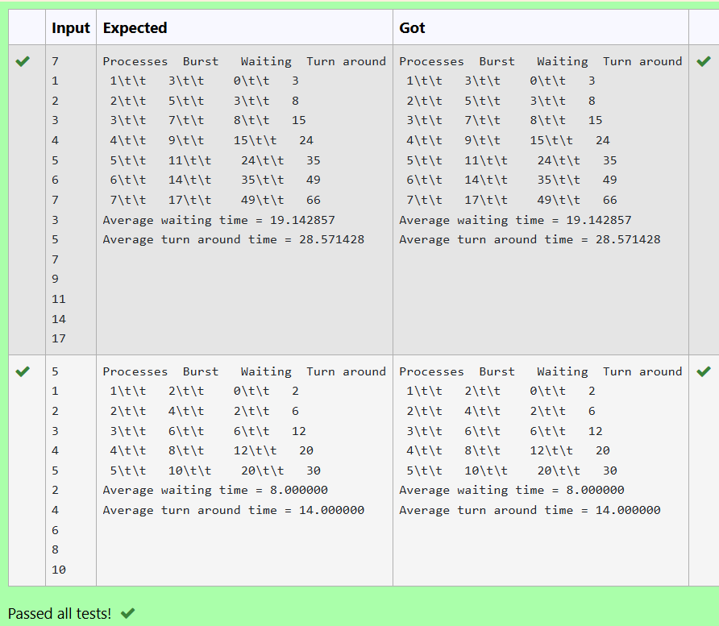

# Ex2E Applications of Queue – FCFS
## DATE: 12/03/2025
## AIM:
To write a C function to calculate the turnaround time of each process given their burst time and waiting time in First Come first Serve scheduling algorithm.
## Algorithm
1.	Start with process, burst time, and waiting time arrays.
2.	Loopthrough each process from i= 0 to n-1.
3.	Compute tat[i] = burst_time[i] + wait_time[i].
4.	End the algorithm.   

## Program:
```
/*
Program to find and display the priority of the operator in the given Postfix expression
Developed by: RAHUL VIJAY V
RegisterNumber: 212223040164
*/

/*#include <stdio.h>*/
int avgtime( int proc[], int n, int burst_time[]) 
{
    int wait_time[n], tat[n], total_wt = 0, total_tat = 0;
    int i;
   //type your code here...
   waitingtime(proc, n, burst_time, wait_time);
   turnaroundtime(proc,n,burst_time,wait_time,tat);
   printf("Processes  Burst   Waiting  Turn around \n");
   
   for(i=0;i<n;i++){
       total_wt = total_wt + wait_time[i];
       total_tat = total_tat + tat[i];
       printf(" %d\t\t   %d\t\t    %d\t\t   %d\n",i+1,burst_time[i],wait_time[i],tat[i]);
   }
   printf("Average waiting time = %f\n", (float)total_wt/(float)n);
   printf("Average turn around time = %f\n", (float)total_tat/(float)n);
   return 0;
}
```

## Output:


## Result:
Thus, the C function to calculate the turnaround time of each process given their burst time and waiting time in First Come first Serve scheduling algorithm is implemented successfully.
