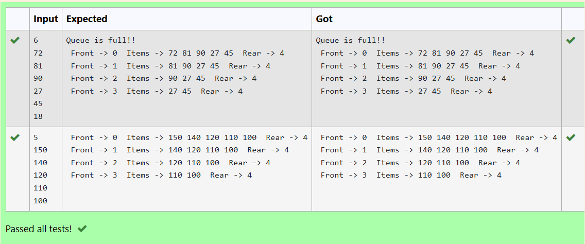

# Ex2A Dequeue Elements from Circular Queue
## DATE: 5/03/2025
## AIM:
To write a C program to delete three elements from the filled circular queue.

## Algorithm
1. Start 
2. Define a queue with a fixed size SIZE and initialize front and rear pointers. 
3. Define the deQueue() function to remove and return an element from the front of the queue. 
4. Check if the queue is empty using isEmpty(); if empty, print an error message. 
5. If the queue has one element, reset both front and rear to -1. 
6. If the queue has more than one element, update front to the next index using modulo 
operation ((front + 1) % SIZE). 
7. Return the removed element from the front of the queue. 
8. End   

## Program:
```
/*
Program to delete three elements from the filled circular queue
Developed by: RAHUL VIJAY V
RegisterNumber: 212223040164
*/

/*#include <stdio.h>

#define SIZE 5

int items[SIZE];
int front = -1, rear = -1;
*/
int deQueue() {
  int  element;
  if (isEmpty()) {
    printf("Queue is empty !! \n");
    return (-1);
  } else {
    element = items[front];
    if (front == rear) {
      front = -1;
      rear = -1;
    } 
    else {
      front = (front + 1) % SIZE;
    }
  }
    return (element);
}

```

## Output:


## Result:
Thus, the C program to delete three elements from the filled circular queue is implemented successfully.
